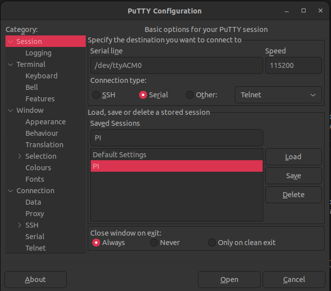

# **customOS**

**v1.0.0**

------

# **Table of content**

- [Overview](#overview)
- [Compiling linux kernel](#compiling-linux-kernel)
- [Setup before first boot](#setup-before-first-boot)
- [First boot](#first-boot)
- [Running simplest init process](#running-simplest-init-process)
- [CustomOS internals](#customos-internals)
    - [myShell](#myShell)
    - [remoteShell](#remoteshell)
    - [receiveApp](#receiveapp)

# Versions

**Table 1** - Library versions.

| Version | Release date | What's new                                                   |
| ------- | ------------ | ------------------------------------------------------------ |
| 1.0.0   | 10.03.2024   | First version.                                               |


# Overview

CustomOS is a minimalist, customized operating system designed for FUN. There are some build systems to create an customized linux OS. Custom OS does not aim to compete with any of them. If the developer is planing to obtain a stable OS with advance features, this project will not help in short time. However, if developer wants to get her/his hands dirty with linux and C programming. CustomOS can be interesting. Main purpose of this repository is building a linux OS by using only "Linux kernel" and "Compiler" for boards like Raspberry pi. 

Key Features:
- Utilizes only the Linux kernel and C implementations.
- Excludes build systems like Yocto and Buildroot.

Required Hardware components:
- A raspberry pi (model is not important but I use zero 2w)
- SD card (size almost doesnt matter since the OS we will build be really tiny)
- Uart-USB serial converter (it is not obligatory, but will be good to have to test some steps)
- Ethernet cable (also usb-ethernet hub for models that does not have RJ45) 

Required Software components:
- [Linux kernel](https://github.com/raspberrypi/linux) source code.
- **arm-linux-gnueabihf** cross compiler. 


Last but not least, A linux host machine. I use ubuntu but it does not matter which linux distro you will use.


# Compiling linux kernel

Raspberry pi [website](https://www.raspberrypi.com/documentation/computers/linux_kernel.html) explains compiling linux kernel for raspberry pi well. You can follow instructions from there but if you are planing to try different configurations. 

Before compiling linux kernel, we should be sure that we have properly prepared SD card. "Properly prepare" means having proper partitions on sd card and also having some set of booting files that are provided by raspberry pi vendor. I am planing to have comprehensive chapter for future but for now I will explain it here briefly. It will be enough for current version of custom OS.

## About booting

There are a few ways to boot a linux kernel on a raspberry pi device. One of these method is using u-boot for booting linux kernel. As I understood after some research, using u-boot is quite common way. However, I will not use u-boot because of two main reasons: 

- I do not know much about u-boot in order to use here.
- Raspberry pi can boot linux kernel directly.

We can come back to SD card preparing topic. Following part explains preparing sd card sections briefly:

- It is better to format the sd card we will use.
- We should create 2 partitions. These are fat32 and ext4 partitions. We will talk about them later.
- We should copy required booting files to fat32 section. This [link](https://github.com/raspberrypi/firmware/tree/master/boot) contains mentioned files. You can copy everything from the link. But, we need only the files : **start.elf**, **fixup.dat**, and **bootcode.bin**.

Up until here, we should have a sd card with two partitions that are fat32 and ext4. So we can start compiling linux kernel and copying it to sd card.

Following script shows basic steps to compile linux kernel with default configuration and copy it to SD card partitions.

```bash
#!/bin/sh

linuxPath=/home/ozgur/linux # Configure here for where you cloned linux kernel source code.

cd $linuxPath

make -j16 ARCH=arm CROSS_COMPILE=arm-linux-gnueabihf- clean

# Prepare default configuration
KERNEL=kernel7
make -j16 ARCH=arm CROSS_COMPILE=arm-linux-gnueabihf- bcm2709_defconfig

make -j16 ARCH=arm CROSS_COMPILE=arm-linux-gnueabihf- zImage modules dtbs

sudo rm -rf mnt

mkdir mnt
mkdir mnt/fat32
mkdir mnt/ext4
sudo mount /dev/sda1 mnt/fat32 # Ensure that you have same partitions names line sda1 and sda2.
sudo mount /dev/sda2 mnt/ext4  # If your partition names are different, change here to make them same.

sudo env PATH=$PATH make ARCH=arm CROSS_COMPILE=arm-linux-gnueabihf- INSTALL_MOD_PATH=mnt/ext4 modules_install

sudo cp arch/arm/boot/zImage mnt/fat32/$KERNEL.img
sudo cp arch/arm/boot/dts/*.dtb mnt/fat32/
sudo cp arch/arm/boot/dts/overlays/*.dtb* mnt/fat32/overlays/
sudo cp arch/arm/boot/dts/overlays/README mnt/fat32/overlays/
sudo umount mnt/fat32
sudo umount mnt/ext4
```

# Setup before first boot

In previous section we have managed to compile linux kernel and prepare basic bootable sd card. However, there are a few more steps before booting. First step is connecting raspberry pi to our host machine via uart-serial converter. I wont get in detailts of this step since it is basic and straight forward. More important part I would like to mention is that having proper **config.txt** and **cmdline.txt** files. **config.txt** is used by raspberry pi firmware before booting kernel and **cmdline.txt** is used by kernel. We should enable uart and configure it properly to see kernel outputs. These file will be changed in future but now we can have simplest versions. 

**config.txt**
```xml
enable_uart=1
kernel=kernel7.img
```

**cmdline.txt**
```xml
console=serial0,115200
```

# First boot

Now we can boot our raspberry pi and see kernel output. In order to see kernel output, we should open serial port from host machine. It is up to you which terminal you want to use. I use screen command to use serial port. Probably simplest way to open this terminal is using putty. In putty you will have something like following image. Ensure that you have proper serial line name.




While preparing this documentation I do not have a free raspberry pi to show you how kernel message should look like. But you should see kernel booting messages and then something like : **Kernel panic - not syncing: No working init found**.

We have bootable sd card with pure linux kernel. We can start building our custom OS components that will work with linux kernel. 


# Running simplest init process

The init process in Linux is the first process that the kernel starts when the operating system boots up. It is responsible for starting all other processes and is the parent to all processes that are subsequently launched. Init sets up the user environment and manages system services and daemons throughout the lifecycle of the system.

As we remember from previous section, Our kernel could not find any init process to run. In this section we will try to run our init process. Our purpose is not writing a useable init process rather we will try to run a basic hello world to prove that we can run our custom init process.

Hello world init example called init.c: 
```c
#include <stdio.h>
#include <unistd.h>

int main(void)
{
    while(1)
    {
        printf("Hello world from custom init.\n");
        sleep(1);
    }
}
```

So we can now compile it by using cross compiler.

```bash
arm-linux-gnueabihf-gcc -static -o init init.c
```

"-static" flag used because our target (raspberry pi) does not have anything except pure kernel. In future we will cross compile libc too. But now we have link all libraries static way. 

Now we need to create a simple initramfs that contains out init and copy it into boot partition (fat32) of sd card.

- Create a simple initramfs folder.

```bash
mkdir -p initramfs/{bin,sbin,etc,proc,sys,dev}
```

- Copy init into initramfs folder.
```bash
cp init ./initramfs/
```

- Create compressed initramfs
```bash
cd ./initramfs
find . | cpio -o -H newc | gzip > ../initramfs.img.gz
cd ..
cp initramfs.img.gz /mnt/fat32
```

Ensure that your sd card's fat32 partition is mounted as /mnt/fat32. Or modify here to have proper destination for copying.
Now we basically have a simple initramfs that will run RAM that has out init process. Lastly, we need to configure our **config.txt**.

**config.txt**
```xml
enable_uart=1
initramfs initramfs.img.gz followkernel
kernel=kernel7.img
```

If you boot raspberry pi, you will see that kernel will not panic and keep printing the message "Hello world from custom init."


# customOS internals

Under the folder customOS there are implementations of some linux commands like mkdir, cat, clear, ls etc. Also there are two scripts. **prepare**
script automates building these applications and deploys to sd card. Since applications are so basic and it is the begging of the project, I did not think the need of using makefiles, in future it can be considered. **compileKernel** script also automates compiling linux kernel. It is mostly possible to compile linux kernel again again for new features. So **compileKernel** helps us to automate this progress.

## custom init

You can find full version of custom init process under folder /customOS/init. I will not explain step by step about init anymore. It is so basic and easily understandable from code.


## myShell

Works with console output, including kernel outputs from boot. Requires a UART connection to Raspberry Pi for usage. This shell provides kernel messages too that means if you have any problem about some hardware drivers, it can be useful to see kernel output.

**myShell** is the first shell implementation that I used while thinkering with custom OS. Later I wanted to exclude serial port connection and work with a ethernet connection. And I have developed [remoteShell](#remoteshell) application that work with [remoteTerminal](remoteterminal) application from host machine.


## remoteShell

Facilitates remote access over UDP sockets, providing an alternative to console-based interaction. Requires an Ethernet connection between the Raspberry Pi and the host machine. Users can choose between these shell implementations based on their connectivity preferences and hardware setup, enabling flexible usage scenarios tailored to individual needs. In order to use remoteShell, you must use remoteTerminal app in host machine to access raspberry's remoteShell.

In version 1.0.0, remoteShell is still experimental. There are some bugs that have to be solved. So I would advise you to use customShell with uart connection.


## receiveApp

While developing some linux command for customOS I had to copy them to sd card by inserting sd card to host machine every time by using **prepare** script. Obviously, this is not a good approach so in order to make this process easy. receiveApp is developed. The receiveApp application allows us to receive any executable from host via ethernet connection. receiveApp works with sendApp application. 